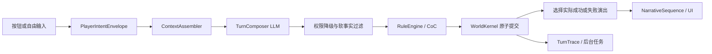

# Living Tabletop V2.2 — Conversation-first, World-guarded

## 核心思想

V2.2 以完整对话体验为主，以世界模型保证不可妥协的一致性。LLM 不是结构化世界数据库的朗读器；World Kernel 也不是对话白名单。普通提问、闲聊、议价、临场表演和非主线行动都由同一个前台 `TurnComposer` 理解并演出，只有位置、时间、物品、数值、检定结果、隐藏硬事实等真正会破坏游戏的状态写入由确定性系统裁决。

## 主流水线



自由输入的正常路径只有一次前台模型调用。按钮保留作者写好的确定性效果和演出，可以离线执行；部分非 Composer 的作者动作仍可由后台 Narrator 扩写，但不会重写已经完整生成的 Composer 回合。

旧版 `TurnPlanner → KnowledgeResolver → DialogueAgent` 仅作为旧存档、录制计划和测试夹具的迁移兼容层存在，不是 V2.2 正常请求路径。

## 1. 上下文以原文为主

`ContextAssembler` 提供：

- 当前玩家原文、世界时间、当前场景和在场角色；
- 最近最多 24 条、约 8000 字符的逐字可见历史，保留 `player / npc / narration`、说话人与受话人；
- 与当前输入相关的玩家已知事实；
- 只属于当前在场 NPC、未隐藏且与当前输入存在词项相关性的知识；
- 生命、理智、幸运、当前位置、物品和技能等只读硬状态；
- 可用作者动作的 ID、标签和类型，但不提供预设对话台词，避免模型重播按钮剧情；
- 玩家明确提及、或已获准事实值中出现的实体。

完整原始对话承担短期连续性；结构化事实只做检索补充。无关 NPC 知识不会因为“确实存在”就全部塞入上下文。这样可以减少本地小模型抓住错误事实答非所问，同时不把未来无法预先枚举的语义压扁成固定槽位。

## 2. Turn Composer 同时理解与演出

`TurnCompositionOutput` 一次返回：

- `decision`：选择一个完全匹配的作者动作，或提出一个开放动作；
- `performance`：1–5 段可直接显示的完整演出；
- `failure_performance`：只有真实检定需要时提供；
- `used_fact_ids`：实际使用的既有事实；
- `proposed_facts`：可选的低风险长期细节；
- 已回答与未回答的问题部分。

重要 NPC 使用第一人称直接对话。当前问题必须先得到回应；NPC 可以不知道、拒绝、犹豫或还价，但不能只复述玩家动作，也不能用旧主线替代当前回答。

普通发言、提问、请求和议价本身是 automatic。只有动作结果存在真实不确定性时才产生 CoC 检定。检定回合由 Composer 同时写出成功与失败分支，RuleEngine 掷骰后只把实际分支交给 UI；模型永远不能自行宣布检定成功。

## 3. 演出 fail-open，状态 fail-closed

结构化元数据和可见文本采用不同失败策略：

- 网络、超时或完全没有可用文本：整轮不提交，前端显示明确模型错误；
- 纯标点、引号或软事实字段错误：补齐排版并保留可见演出；
- 模型误把问路当移动：降级成不改变位置的 TALK/OTHER，保留回答；
- 无效、冲突或越权的 `proposed_facts`：只丢弃事实提案，不丢弃回复；
- 精确泄露未授权隐藏硬事实：整轮拒绝，不显示秘密；
- 任何硬状态写入失败：Kernel 原子回滚。

因此“模型已经回答，但一个辅助字段不合法”不会再伪装成连通性故障，也不会让 NPC 突然沉默。

## 4. 权限分层

| 内容 | 所有者 | LLM 权限 |
| --- | --- | --- |
| 玩家原文与是否明确移动 | 服务端 | 只能解释，不能改写授权 |
| HP / SAN / LUCK / 物品 / 位置 / 时间 | World Kernel | 只读；通过效果提议、由 Kernel 校验 |
| CoC 掷骰和成功等级 | RuleEngine | 不可伪造 |
| 谜底、身份、生死、亲属、核心历史 | 硬事实 | 只能引用当前说话 NPC 获准的 fact id |
| 地址、路线、营业时间、外观、习惯、普通名声 | 软事实 | 可以即兴并提案保存 |
| 氛围、态度、一次性措辞 | Turn Composer | 可自由创作，不强制结构化 |

`used_fact_ids` 只有在玩家已经知道，或当前在场说话 NPC 的相关知识中出现时才能被披露。即便模型猜中隐藏 fact id，也不会获得权限。

## 5. 软事实与长期连续性

通过 `SoftFactValidator` 的提案会生成稳定哈希 ID，并在同一行动事务中执行：

```text
create_fact → add_npc_knowledge → reveal_fact
```

实体必须已存在且对当前上下文可访问；事实只能是 mutable `soft_canon`。与硬事实重叠、针对玩家数值、或试图创建谜底的提案会被丢弃。即使模型没有提出长期事实，本轮逐字输出仍会进入可见历史，供近期对话连续使用。

## 6. 移动和开放世界

玩家可以离开主线、回家休息、去剧本外地点或永久放弃案件。`PlanValidator` 只保护授权边界：

- “疗养院在哪里”不授权 MOVE；
- “我走到窗边，但仍留在房间”是场景内动作，不授权跨场景 MOVE；
- “我现在去疗养院”可以移动；
- 物理上不可能的尝试仍被理解和演出，但不会凭宣称改写硬状态。

Director 只能通过世界内事件制造机会和提醒，不能传送玩家、强制回主线或把线索机会当成玩家结论。

## 7. 可追踪和兼容

每轮 `TurnTrace` 保存原始输入、上下文摘要、Composer 原始输出、最终开放计划、Kernel 事件、状态差异和 Outcome。`AgentCallRecord` 记录模型、耗时、token、校验结果和输出摘要。开发者视图可读，玩家视图不可见。

保留的兼容面：

- `GameEngine`、`RuleEngine`、`WorldKernel`、场景 JSON、SQLite 快照和 EventLog；
- 旧 `OpenActionPlan`、录制回放和 `Keeper` API；
- 作者按钮、CoC 规则、地图投影和现有前端；
- 本地优先、远程后备的 `RoutedLLM`。

## 8. Test Agent

V2.2 增加正式的动态测试玩家。8 种人格不会点击默认按钮，而是依据当前公开场景生成互不重复的自由文本，覆盖问路不移动、连续追问、天气闲聊、议价、复合句、指代、捣乱、离题和场景内动作。

快速合约模拟器用于数百轮状态不变量 fuzzing；真实本地/API 模型用于较小规模的 Schema、文风、相关性和延迟烟测。失败会保留角色、输入、探针、状态版本和可见输出，形成可复现失败语料。详见 [TEST_AGENT.md](TEST_AGENT.md)。

## 不变量

1. 玩家原文逐字进入回合，并保持玩家是发言或动作主体。
2. 提问或地点提及不能改变位置；明确留在场景内的动作也不能跨场景。
3. 普通对话必须产生完整可见回应；软元数据错误不能删除回应。
4. 隐藏硬事实只能由获准的当前说话 NPC 披露。
5. LLM prose 不能直接修改硬状态；所有副作用由 Kernel 原子提交。
6. 机械检定只显示 RuleEngine 选中的 Composer 分支。
7. 新回合不能重播上一轮演出；中断事件可以合理打断回答。
8. 自由输入不自动计为 off-main，玩家可以永久偏离主线。
