# Living Tabletop Architecture V2.1 — LLM-first, World-guarded

## 目标

V2.1 将 LLM 放在“理解与完整演出”位置，把检定、状态变化、硬事实冲突和披露权限留在可验证的系统层。世界模型是连续性守卫和长期记忆，不是对话白名单。自由输入与按钮拥有同一条执行流水线；玩家可以偏离剧本，但自由输入本身不等于偏离主线。

## 主流水线

```mermaid
flowchart LR
    A[IntentOption / Free text] --> B[PlayerIntentEnvelope]
    B --> C[ContextAssembler]
    C --> D[TurnPlanner LLM]
    D --> E[PlanValidator]
    E --> F[KnowledgeResolver]
    F --> G[DisclosurePolicy]
    G --> H{TALK?}
    H -->|yes| I[DialogueAgent LLM]
    I --> J[SoftFactValidator]
    H -->|no| K[ValidatedActionPlan]
    J --> K
    K --> L[GameEngine / RuleEngine]
    L --> M[WorldKernel atomic commit]
    M --> N[OutcomeEnvelope]
    N --> O{Complete dialogue?}
    O -->|yes| Q[NarrativeSequence / UI]
    O -->|no| P[Narrator LLM]
    P --> Q
```

`TurnPlanner`、`DialogueAgent` 与 `Narrator` 是生成式角色。自由对话由 DialogueAgent 一次写成完整回复，不再经过第二个 Narrator 重写。Director 是确定性策略；KnowledgeResolver、DisclosurePolicy 与 PlanValidator 提供上下文和硬边界，但不决定台词是否“有资格”存在。只有 DialogueAgent 显式提出且通过 SoftFactValidator 的低风险细节能够成为新世界事实。

## 核心决策

### 1. 输入统一

按钮与自由文本先转换为 `PlayerIntentEnvelope`：

- `source`: `option` 或 `free_text`
- `text`: 玩家实际表达；按钮可使用其第一人称台词或标签
- `intent_seed`: 按钮携带的动作 ID、动作类型和硬约束；自由输入为空
- `actor_id` 与 `scene_id`: 输入发生时的确定性世界坐标

按钮种子可以让系统离线执行，但不会绕过统一的验证、追踪、结算和叙事边界。

### 2. Planner 不写结果

`TurnPlanner` 只解析：

- 动作类型、目标、目的地、时长和风险
- 是否存在真实不确定性，是否需要检定
- 对话行为、说话对象、指代与 `KnowledgeQuery`

Planner 输出契约中没有成功文本、失败文本、效果列表或事实值。任何旧式 `success_text` / `failure_text` 即使由兼容输入提供，也会在验证前被丢弃。

玩家原文是服务器持有的授权边界：`goal` 由服务端覆盖为原始输入，不因模型把 `?` 改成 `？` 或整理空格而拒绝。自由文本计划若会改变位置，`PlanValidator` 必须能从玩家原文中找到明确的动身承诺；“疗养院在哪里”这类提问和单纯地点提及不能授权 `MOVE`。执行层在应用移动效果前重复检查这一不变量，因此单次 Planner 误判不会改变地点或推进时间。

本地模型的传输超时、连接错误与 5xx 会短重试一次，耗尽后才进入短暂熔断。模型已成功响应但结构化内容无效时交给 Harness 修复，不打开网络熔断；修复仍失败会向前端报告“行动计划未通过安全校验”，而不是“无法连接 LLM”。

### 3. 检索提供依据，不充当台词白名单

`KnowledgeResolver` 只检索 `WorldState.facts` 与 `npc_knowledge`。它不会把普通 prose 当作新事实，也不会因为语义相似而让 NPC 知道未写入其知识表的硬知识。它的输出是 DialogueAgent 的证据上下文，而不是“只能围绕这些句子回答”的白名单。

`KnowledgeRetriever` 是稳定接口。当前 `typed_hybrid_v2` 的流程是：

1. 将复合问题拆成最多六个独立 `KnowledgeQueryAtom`；本地模型给出的未知关系标签会被丢弃。
2. 先按 NPC 知情范围、实体、人物焦点、关系类型和历史范围做硬过滤。
3. 对剩余事实计算中文二/三元组 BM25 与结构化得分，并用 RRF 融合排名；按 NPC 知识内容签名复用小型只读索引，事实或信念变化时自动换键重建。
4. `DisclosurePolicy` 按 atom 选出能够作为既有事实引用的证据。未被事实覆盖的 atom 对硬知识仍为 unknown，但日常低风险细节可以交给 DialogueAgent 合理补全。

检索保持纯 CPU、无额外模型依赖。以后可增加 semantic RAG，但向量或长文档检索只能补充候选，不能绕过类型过滤和披露授权。固定 eval set 与基准报告分别位于 `evals/retrieval/the_haunting_v1.json` 和 `artifacts/benchmarks/retrieval-benchmark.md`。

### 4. 披露是规则决策

`DisclosurePolicy` 将候选分为：

- `automatic`: NPC 知道且不隐瞒，直接披露
- `check`: NPC 隐瞒或存在真实阻力，经过规则检定
- `refuse`: 世界规则明确禁止
- `unknown`: 没有可支持的知识

只有 WorldKernel 提交的 `fact_disclosed` / `player_learned_fact` 事件能增加玩家知识。事件必须携带 `fact_id` 和来源 NPC。披露规则不会强制 DialogueAgent 对日常问题保持沉默；它只限制隐藏硬事实不能被越权说出。

### 5. DialogueAgent 负责完整对话和低风险即兴

自由输入的 TALK 计划会调用 DialogueAgent。输入包含玩家原文、说话对象、场景、最近可见历史、玩家已知事实、允许披露的 NPC 事实、问题分项，以及可用于软事实提案的已存在实体。输出包含：

- 1–4 个可直接展示的完整演出段；
- 实际重述的既有 `fact_id`；
- 可选的 `SoftFactProposal`；
- 已回答和仍无法回答的问题分项。

地址、城区、路线、路程、营业时间、普通名声、外观、习惯、偏好等低风险细节可以即兴生成。谜底、身份、生死、亲属、所有权、核心历史、伤害和规则数值不能由该通道创造。SoftFactValidator 只检查实体存在、说话权限和与已建立事实的冲突，不要求台词逐字复述检索文本。通过校验后，`create_fact → add_npc_knowledge → reveal_fact` 与行动结果在同一次 WorldKernel 提交中完成；因此台词与世界记忆不会出现一边成功、一边丢失的状态。

### 6. Director 只制造机会

Director 可以改变可见机会、时间压力、威胁和可供选择的 affordance；不能把“可调查的便笺”直接升级为“玩家已经得出结论”。`world_justification` 只供开发者审计；只有显式 `player_visible_text` 能进入玩家演出和 Narrator 的 OutcomeEnvelope。

`open__*` 不是偏离主线的证据。只有进入标记为 `off_main` 的场景并继续在该支线活动，才会影响偏离遥测。

### 7. Narrator 只消费非对话行动的本轮结果

WorldKernel 结算后生成 `OutcomeEnvelope`，其中只包含：

- 本轮动作与机械结果
- 本轮新增或获准重述的事实
- 本轮可见事件
- 当前可见场景与在场实体
- Director 本轮制造的机会（若有）

Narrator 不再接收“玩家全部已知事实”。GroundingValidator 会在生成文本进入 UI 前检查未批准事实值、未在场角色和跨话题内容；失败时保留确定性演出，不污染世界状态。DialogueAgent 已经交付完整 TALK 演出时，不再启动异步 Narrator，避免第二次生成删掉答案、重复剧情或把话题拉回旧主线。

### 8. 每轮可追踪

`TurnTrace` 保存输入、上下文摘要、Planner 输出、验证结果、知识查询、证据候选、披露决策、Dialogue 输出、Kernel 事件、状态差异、OutcomeEnvelope 和 grounding 结果。开发者视图可读，玩家视图不可见。

## 兼容策略

- `GameEngine`、`RuleEngine`、`WorldKernel`、`ScenarioDefinition`、SQLite 快照和 EventLog 继续保留。
- 旧回放中的 `OpenActionPlan.success_text` / `failure_text` 仍可读取；新 Planner 不产生这些字段。
- 新字段全部有默认值，旧存档可以直接加载。
- `Keeper` 暂保留为旧 API 适配器；主执行链改用 `TurnPlanner`。
- authored action 继续由场景定义提供效果和演出，但新增事实仍必须对应 Kernel 的事实事件。

## 不变量

1. 玩家输入永远先被接受为意图，物理上不可能的结果可以失败，但不能把输入误路由成另一件事。
2. 自由输入不自动计为 off-main。
3. Director 机会不等于玩家结论。
4. 既有硬事实的 NPC 披露必须能追溯到 `npc_knowledge`、`fact_id` 和来源 NPC。
5. 普通 prose 不能修改 `WorldState`；只有通过校验的显式软事实提案可以由 Kernel 写入。
6. DialogueAgent 不能获得未授权隐藏硬事实的值，也不能创建新实体或替玩家移动。
7. Narrator 不能获得本轮 OutcomeEnvelope 之外的隐藏或无关事实。
8. 按钮和自由文本都产生 `PlayerIntentEnvelope` 与 `TurnTrace`。
